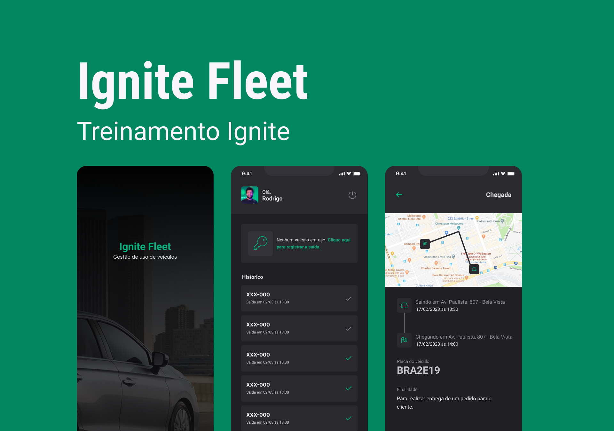

<h1 align='center'>Ignite Fleet</h1>

<div align="center">
  <p>
     
     
     
     

  </p>
</div>

<p align='center'>
  
</p>

<br>

## 💻 Projeto


Aplicativo de gestão de uso de veículos desenvolvido para colaboradores. Com uma interface intuitiva e recursos eficientes, além de ter o login social com a conta Google, o aplicativo permite que os usuários registrem o uso de veículos da frota de maneira prática e organizada.


## 🛠 Tecnologias

Esse projeto foi desenvolvido com as seguintes tecnologias:

- [Expo](https://expo.dev/)
- [Typescript](https://www.typescriptlang.org/)
- [ReactNative](https://reactnative.dev/)
- [React-Navigation/native](https://reactnavigation.org/docs/getting-started/)
- [React-Navigation/native-stack](https://reactnavigation.org/docs/hello-react-navigation)
- [AsyncStorage](https://docs.expo.dev/versions/latest/sdk/async-storage)
- [NetInfo](https://docs.expo.dev/versions/latest/sdk/netinfo)
- [Realm](https://realm.io/)
- [Dayjs](https://day.js.org/)
- [Expo-auth-session](https://docs.expo.dev/versions/latest/sdk/auth-session/)
- [Expo-crypto](https://docs.expo.dev/versions/latest/sdk/crypto/)
- [Expo-image](https://docs.expo.dev/versions/latest/sdk/image/)
- [Expo-web-browser](https://docs.expo.dev/versions/latest/sdk/webbrowser)
- [Phosphor-react-native](https://github.com/duongdev/phosphor-react-native)
- [React-native-get-random-values](https://github.com/LinusU/react-native-get-random-values)
- [React-native-keyboard-aware-scroll-view](https://github.com/APSL/react-native-keyboard-aware-scroll-view)
- [React-native-svg](https://github.com/software-mansion/react-native-svg)
- [React-native-toast-message](https://github.com/calintamas/react-native-toast-message)
- [Styled-Components](https://www.styled-components.com/)
- [Expo-location](https://docs.expo.dev/versions/latest/sdk/location)
- [React-native-maps](https://docs.expo.dev/versions/latest/sdk/map-view/)
- [Expo-task-manager](https://docs.expo.dev/versions/latest/sdk/task-manager/)

## 🚀 Instalação

```bash
  # Clone o repositório e entre na pasta do projeto
  $ git clone https://github.com/pcaldi/ignitefleet.git
  $ cd ignitefleet
  # Instale as dependências
  $ npm install
  # ou
  $ yarn install
  # Execute a aplicação
  $ npx expo start
  # ou
  $ yarn start
```

## 🔖 Layout

- Você pode visualizar o layout do projeto através [desse link](<https://www.figma.com/file/vm3tXGYk0Hh9NgqBIjHhAA/Ignite-Fleet-(Community)?type=design&node-id=47%3A2&mode=design&t=bHaJgcqUQwEXSEwF-1>). É necessário ter conta no [Figma](http://figma.com/) para acessá-lo.


## 📲 Contato

<a href="mailto:pcaldi@gmail.com"></a>

<a href="https://www.linkedin.com/in/pcaldi/"></a>


## 📝 License

Esse projeto possui [licença MIT](./LICENSE).

---

<h5 align="center">
  &copy;2023 - <a href="https://github.com/pcaldi">Paulo Caldi</a>
</h5>
